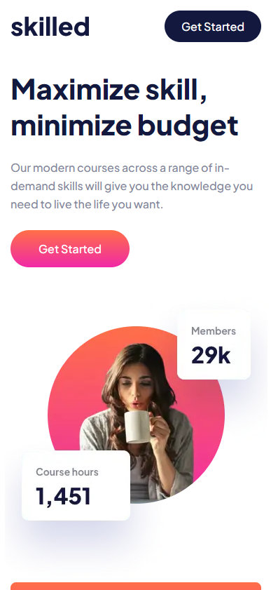
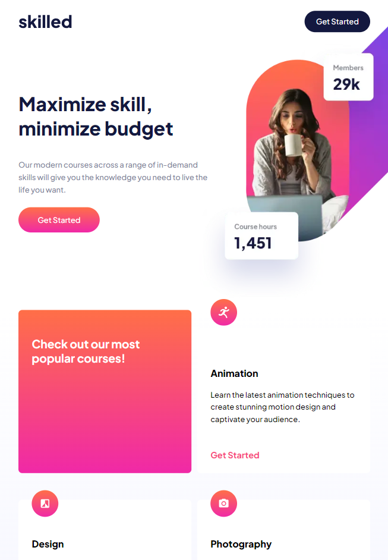
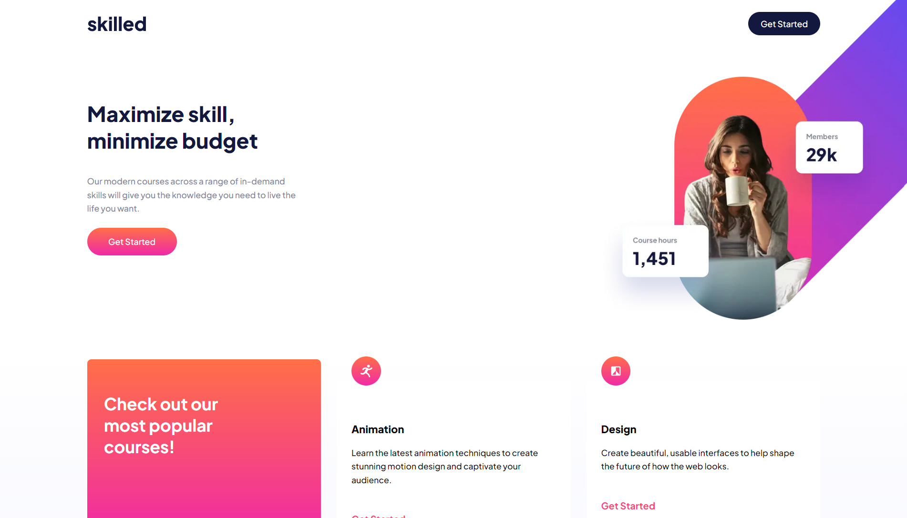

# Frontend Mentor - Skilled e-learning landing page solution

This is a solution to the [Skilled e-learning landing page challenge on Frontend Mentor](https://www.frontendmentor.io/challenges/skilled-elearning-landing-page-S1ObDrZ8q). Frontend Mentor challenges help you improve your coding skills by building realistic projects.

## Table of contents

- [Overview](#overview)
  - [The challenge](#the-challenge)
  - [Screenshot](#screenshot)
  - [Links](#links)
- [My process](#my-process)
  - [Built with](#built-with)
  - [What I learned](#what-i-learned)
  - [Continued development](#continued-development)
- [Author](#author)

## Overview

### The challenge

Users should be able to:

- View the optimal layout depending on their device's screen size
- See hover states for interactive elements

### Screenshots





### Links

- Solution URL: [https://github.com/pedrommb7/skilled-landing-page](https://github.com/pedrommb7/skilled-landing-page)
- Live Site URL: [https://skilledelearning-fm.netlify.app/](https://skilledelearning-fm.netlify.app/)

## My process

### Built with

- Semantic HTML5 markup
- BEM
- Flexbox
- CSS Grid
- Mobile-first workflow
- [React-TypeScript](https://reactjs.org/)

### What I learned

In this project the most relevant learning was how to position an image out of the normal flow of the website, so that I could move it around and place it where it was necessary. For that I used relative positioning on the parent container and absolute positioning on the image. And the "top, right, bottom and left" properties.

```css
.callToAction {
  overflow: hidden;
  position: relative;
  ... @include isMediaTablet() {
    &__container {
      display: flex;

      &__text {
        width: 398px;
        height: 384px;

        display: flex;
        flex-direction: column;
        justify-content: center;
      }

      &__imgHero {
        &__mobile {
          display: none;
        }

        &__tablet,
        &__desktop {
          position: absolute;
        }

        &__tablet {
          display: block;
          right: -36%;
          top: -67%;
        }

        &__desktop {
          display: none;
        }
      }
    }
  }
}
```

## Author

- Frontend Mentor - [@pedrommb7](https://www.frontendmentor.io/profile/pedrommb7)
